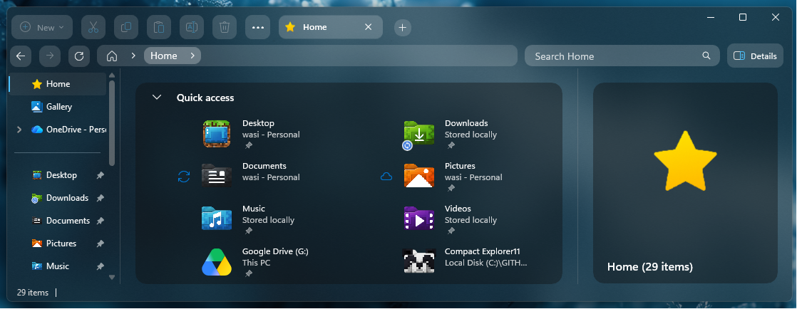
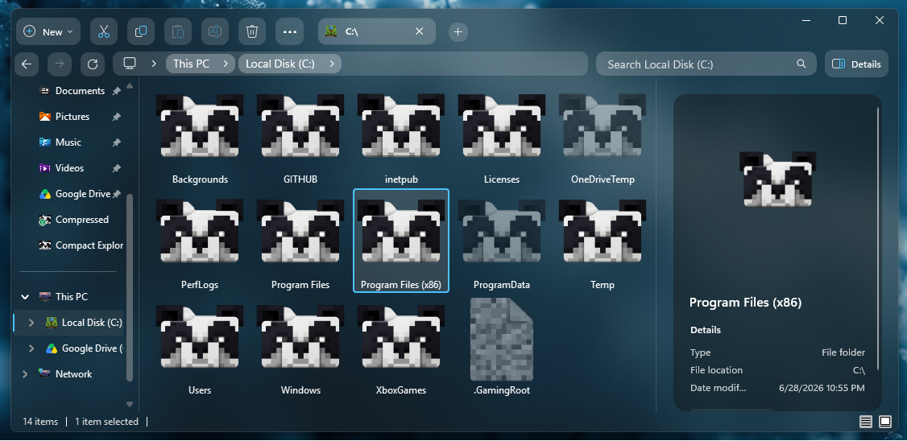
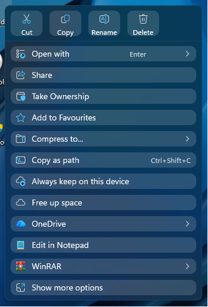
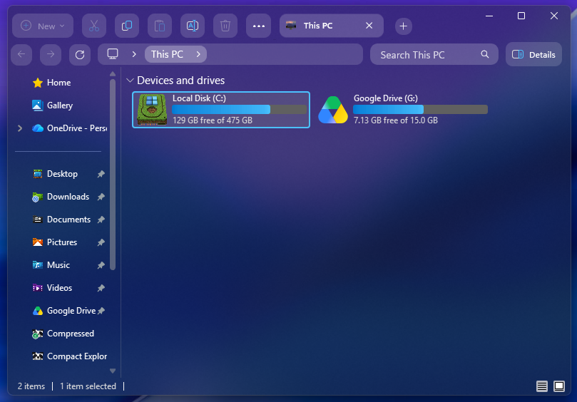
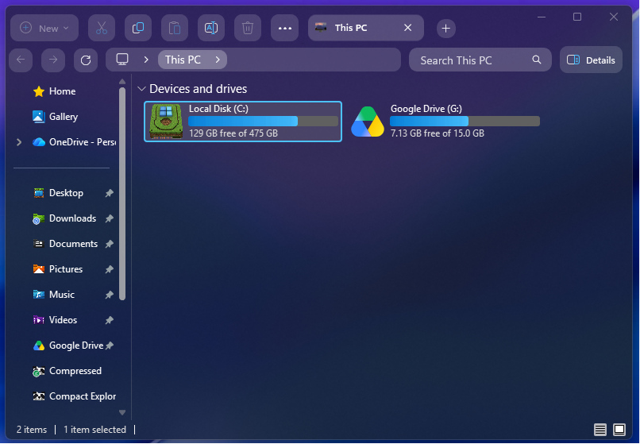
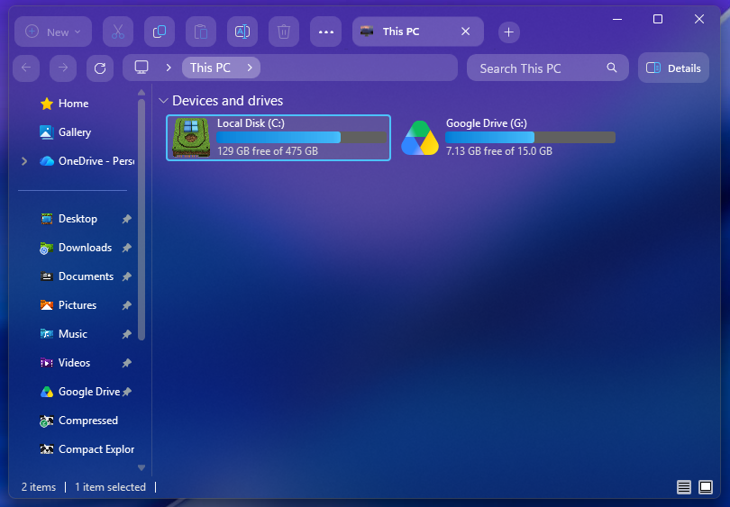

# Compact Explorer11 Style

This style modifies Windows 11 File Explorer to make it compact, and occupy less space vertically and look better.

## Explorer Previews





## Context Menu Previews


## Support for Light Mode

Unfortunately, this mod does not work appropriately with Light Mode. In Light Mode, the UI elements will not contrast with the background and the style won't look right.

## BlurBehind Requirements

To achieve the translucent effect in Explorer shown in the preview, you will need an external background blur tool:

* **Recommended:** The [Translucent Windows](https://windhawk.net/mods/translucent-windows) Windhawk mod (easiest to set up).
* **Alternative:** The third-party utility `ExplorerBlurMica`.

### Custom AccentBlurBehind Tinting
If the translucent background makes text hard to read on light backgrounds, you can add a custom AccentBlurBehind code in the settings page of the Translucent Windows Mod!
Here is a preview of the codes that can be used:

* **Tint Code 1:** `761E1E1E`

  Preview: 
  
   

* **Tint Code 2:** `B31A1A1A`

  Preview: 
  
   

* **Tint Code 3 (Default):** `3A232323`

  Preview:
  
   

---

## Theme Selection
Once merged, this theme will be integrated natively into the mod configuration and can be toggled directly from the main dropdown menu in the mod settings.

## Manual Installation
To test or apply this theme manually right now:
1. Open the **Windows 11 File Explorer Styler** mod in Windhawk.
2. Navigate to the **Settings** tab and toggle the viewing mode to **"Textual mode"**.
3. Clear the text area, copy the complete configuration block below, paste it inside, and hit **"Save settings"**.

<details>
<summary> Content to import (click to expand)</summary>

```yaml
theme: ''
backgroundTranslucentEffect: none
backgroundTranslucentEffectRegion: entireWindow
styleConstants:
  - ''
controlStyles:
  - target: Microsoft.UI.Xaml.Controls.Primitives.SuggestionsPopup
    styles:
      - Margin=0,0,0,900
  - target: Microsoft.UI.Xaml.Controls.AppBarButton > Grid@CommonStates
    styles:
      - Background@Disabled:=<WindhawkBlur BlurAmount="8" TintColor="#25ffffff"/>
      - Background@Disabled:=<WindhawkBlur BlurAmount="8" TintColor="#25ffffff"/>
      - CornerRadius@Disabled=10
      - BorderThickness@Disabled=1
      - Margin@Disabled=2,6,2,6
      - Padding@Disabled=0,-7

  - target: CommandBar#FileExplorerCommandBar > Grid#LayoutRoot > Grid#ContentRoot > Button#MoreButton
    styles:
      - Background:=<WindhawkBlur BlurAmount="8" TintColor="#25ffffff"/>
      - CornerRadius=10
      - BorderThickness=1
      - Margin=3,2,3,2
      - Width=45
      - Height=32


  - target: Microsoft.UI.Xaml.Controls.AppBarButton#backButton > Grid@CommonStates
    styles:
      - Background@Disabled:=<WindhawkBlur BlurAmount="8" TintColor="#25ffffff"/>
      - CornerRadius@Disabled=11
      - BorderThickness@Disabled=1
      - Margin@Disabled=0,0,0,0
      - Height@Disabled=32
      - Width@Disabled=20
      - Padding@Disabled=0,-2,0,2
  - target: Microsoft.UI.Xaml.Controls.AppBarButton#forwardButton > Grid@CommonStates
    styles:
      - Background@Disabled:=<WindhawkBlur BlurAmount="8" TintColor="#25ffffff"/>
      - CornerRadius@Disabled=11
      - BorderThickness@Disabled=1
      - Margin@Disabled=0,0,0,0
      - Height@Disabled=32
      - Width@Disabled=20
      - Padding@Disabled=0,-2,0,2
  - target: Microsoft.UI.Xaml.Controls.AppBarButton#refreshButton > Grid@CommonStates
    styles:
      - Background@Disabled:=<WindhawkBlur BlurAmount="8" TintColor="#25ffffff"/>
      - CornerRadius@Disabled=11
      - BorderThickness@Disabled=1
      - Margin@Disabled=0,0,0,0
      - Height@Disabled=32
      - Width@Disabled=20
      - Padding@Disabled=0,-2,0,2
  - target: Microsoft.UI.Xaml.Controls.AppBarToggleButton > Grid@CommonStates
    styles:
      - Background@Disabled:=<WindhawkBlur BlurAmount="8" TintColor="#2D101010"/>

  - target: Grid#DetailsViewControlRootGrid
    styles:
      - Margin=20,20,20,1
      - Background:=<WindhawkBlur BlurAmount="30" TintColor="#2D101010" TintOpacity="0.4"/>
      - CornerRadius=15

  - target: StackPanel#DetailsViewThumbnail > Grid
    styles:
      - Background=Transparent

  - target: Microsoft.UI.Xaml.Controls.Grid > OuterOverflowContentRootV2
    styles:
      - CornerRadius=250

  - target: Microsoft.UI.Xaml.Controls.CommandBarOverflowPresenter > Microsoft.UI.Xaml.Controls.CommandBarOverflowPresenter
    styles:
      - Background=transparent

  - target: AppBarButton[7]
    styles:
      - Visibility=Collapsed
      - Width=0
      - MinWidth=0
      - Margin=0,0,0,0
      - Padding=0,0,0,0

  - target: Microsoft.UI.Xaml.Controls.Viewbox > ContentViewB
    styles:
      - Visibility=Collapsed

  - target: Grid#HomeViewRootGrid
    styles:
      - Margin=20,20,20,0
      - Background:=<WindhawkBlur BlurAmount="30" TintColor="#2D101010" TintOpacity="0.4"/>
      - CornerRadius=15

  - target: FileExplorerExtensions.GalleryViewControl#GalleryViewControl > Grid
    styles:
      - Margin=20,20,20,0
      - Background:=<WindhawkBlur BlurAmount="30" TintColor="#2D101010" TintOpacity="0.4"/>
      - CornerRadius=15

  - target: Microsoft.UI.Xaml.Controls.Grid#GalleryRootGrid
    styles:
      - Margin=10
      - Background:=transparent
      - CornerRadius=15

  # CommandBar: left-aligned, auto width so it only takes what it needs
  # This avoids overlapping the tab strip and removes the need to shift tabs
  - target: CommandBar#FileExplorerCommandBar
    styles:
      - Grid.Row=0
      - Grid.RowSpan=1
      - CornerRadius:=15
      - Width=400
      - HorizontalAlignment=Left
      - Background:=transparent
      - Padding=0,0,0,0

  # FIX 1: Target the overflow separator — this is the actual element
  # creating the visual gap between the last icon and the MoreButton.
  # Collapsing it with Width=0 removes the reserved layout space entirely.
  - target: CommandBar#FileExplorerCommandBar > Grid#LayoutRoot > Grid#ContentRoot > Grid#OverflowSeparator
    styles:
      - Visibility=Collapsed
      - Width=0
      - MinWidth=0

  # Also left-align the items container so MoreButton hugs the last icon
  - target: CommandBar#FileExplorerCommandBar > Grid#LayoutRoot > Grid#ContentRoot
    styles:
      - HorizontalAlignment=Left

  - target: CommandBar#FileExplorerCommandBar > Grid#LayoutRoot > Grid#ContentRoot > ItemsControl#PrimaryItemsControl
    styles:
      - HorizontalAlignment=Left

  - target: CommandBar#FileExplorerSecondaryCommandBar
    styles:
      - Visibility=Visible
      - Margin=0,40,0,-20

  # FIX 2: Remove the Margin shift entirely — shifting via Margin moves
  # the visual but NOT the parent container's hit region, creating a dead
  # zone that eats drag input. Instead, the CommandBar's natural auto-width
  # (HorizontalAlignment=Left above) will leave the tab strip space free.
  - target: Grid#TabContainerGrid
    styles:
      - Margin=370,1,0,1

  - target: Grid#TabContainerGrid > Border#LeftBottomBorderLine
    styles:
      - Visibility=Collapsed

  - target: Grid#TabContainerGrid > Border#RightBottomBorderLine
    styles:
      - Visibility=Collapsed

  - target: TabViewItem
    styles:
      - Width=150

      - Height=40
      - Margin=0,0,8,0

  - target: TabViewItem > Grid#LayoutRoot
    styles:
      - Background:=<WindhawkBlur BlurAmount="8" TintColor="#25ffffff"/>
      - CornerRadius=10
      - BorderThickness=1
      - Margin=2,2,0,2
      - Height=35

  - target: TabViewItem > Grid#LayoutRoot > Canvas
    styles:
      - Visibility=Collapsed

  - target: TabViewItem > Grid#LayoutRoot > Grid#TabContainer
    styles:
      - Background=Transparent
      - BorderThickness=0

  - target: TabViewItem > Grid#LayoutRoot@CommonStates
    styles:
      - Background@Selected:=<WindhawkBlur BlurAmount="15" TintColor="#30ffffff"/>
      - Background@PointerOverSelected:=<WindhawkBlur BlurAmount="15" TintColor="#40ffffff"/>
      - Background@Normal:=<WindhawkBlur BlurAmount="15" TintColor="#20ffffff"/>

  - target: Grid#TabContainerGrid > Border > Button#AddButton
    styles:
      - Visibility=Visible
      - Margin=0,0,0,4
      - Background:=<WindhawkBlur BlurAmount="15" TintColor="#25ffffff"/>
      - CornerRadius=10
      - BorderThickness=0
      - BorderBrush:=<LinearGradientBrush EndPoint="1,1" StartPoint="0,0"><GradientStop Color="#80ffffff" Offset="0.0"/><GradientStop Color="{ThemeResource SurfaceStrokeColorDefault}" Offset="0.55"/><GradientStop Color="#80ffffff" Offset="1"/></LinearGradientBrush>
      - Width=24
      - Height=24

  - target: Grid#CommandBarControlRootGrid
    styles:
      - Background:=
      - BorderBrush:=

  - target: Grid#NavigationBarControlGrid
    styles:
      - Background=Transparent

  - target: Grid#PART_LayoutRoot
    styles:
      - Background:=<WindhawkBlur BlurAmount="8" TintColor="#25ffffff"/>
      - CornerRadius=10
      - BorderThickness=1
      - Margin=1

  - target: FileExplorerExtensions.CommandBarControl
    styles:
      - Grid.Row=0
      - Grid.RowSpan=2
      - Margin=0,0,0,0

  - target: AutoSuggestBox#FileExplorerSearchBox > Grid#LayoutRoot > TextBox > Grid@CommonStates
    styles:
      - Background:=<WindhawkBlur BlurAmount="8" TintColor="#25ffffff"/>
      - CornerRadius=10
      - Margin=-90,0,90,0
      - Height=30

  - target: Microsoft.UI.Xaml.Controls.Grid#FileExplorerAddressBarGrid
    styles:
      - Margin=-8,0,90,0

  - target: Microsoft.UI.Xaml.Controls.AppBarButton
    styles:
      - Background:=<WindhawkBlur BlurAmount="8" TintColor="#25ffffff"/>
      - CornerRadius=10
      - BorderThickness=1
      - Margin=3,2,3,2

  - target: Microsoft.UI.Xaml.Controls.AppBarToggleButton
    styles:
      - Background:=<WindhawkBlur BlurAmount="8" TintColor="#2D101010"/>
      - CornerRadius=8
      - BorderThickness=1
      - Margin=3,0,3,1
      - BorderBrush:=<LinearGradientBrush EndPoint="1,1" StartPoint="0,0"><GradientStop Color="#80ffffff" Offset="0.0"/><GradientStop Color="{ThemeResource SurfaceStrokeColorDefault}" Offset="0.55"/><GradientStop Color="#80ffffff" Offset="1"/></LinearGradientBrush>

  - target: Microsoft.UI.Xaml.Controls.AppBarSeparator
    styles:
      - Visibility=Collapsed

  - target: Microsoft.UI.Xaml.Controls.AppBarButton#backButton
    styles:
      - Margin=0,9,9,0
      - Visibility=Visible

  - target: Microsoft.UI.Xaml.Controls.AppBarButton#forwardButton
    styles:
      - Margin=0,9,9,0
      - Visibility=Visible

  - target: Microsoft.UI.Xaml.Controls.AppBarButton#upButton
    styles:
      - Margin=0,9,9,0
      - Visibility=Collapsed

  - target: Microsoft.UI.Xaml.Controls.AppBarButton#refreshButton
    styles:
      - Visibility=Visible
      - Margin=0,9,9,0

  - target: Microsoft.UI.Xaml.Controls.AppBarButton#stopButton
    styles:
      - Visibility=Collapsed
      - Margin=0,9,9,0

  - target: FileExplorerExtensions.NavigationBarControl
    styles:
      - Grid.RowSpan=2

themeResourceVariables:
  - ''
explorerFrameContainerHeight: 87
xamlDiagnosticsHandling: ''
