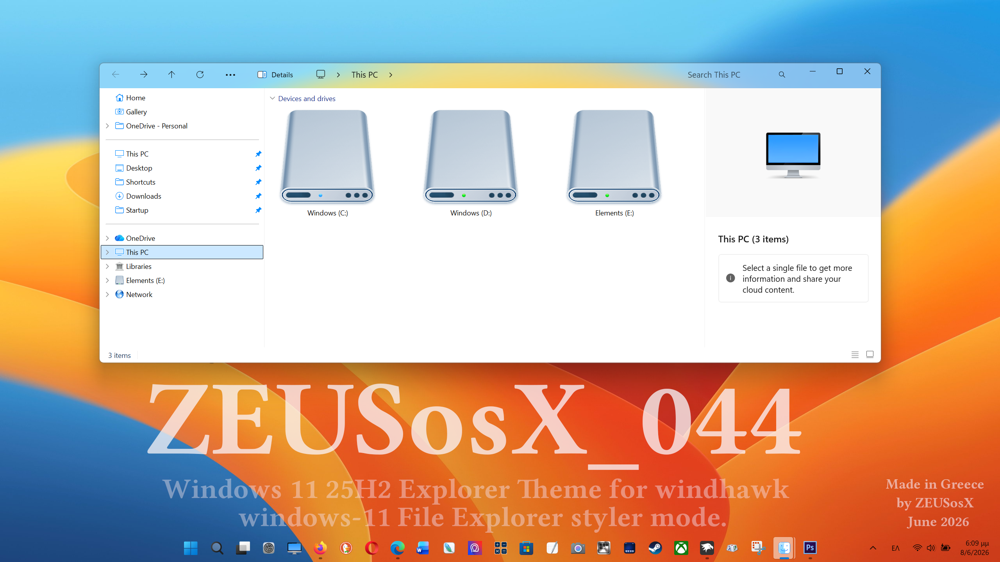

# ZEUSosX_044 theme for Windows 11 File Explorer Styler

An elegant, minimal single-row configuration optimized to completely remove cluttered stock borders and resolve common layout bugs across modern Windows builds (24H2/25H2).

**Author**: [ZEUSosX](https://github.com/ZEUSosX)



## ✨ Key Features

### 📏 **44px Height - Ultra-Compact Layout**
A beautifully compressed single-row design that maximizes content viewing space while maintaining perfect visual balance.

### 🎯 **100% Verified Universal Scale**
Rigorously tested and calibrated across **ALL DPI Scaling factors**:
- ✅ 100%
- ✅ 125%
- ✅ 150%
- ✅ 175%
- ✅ 200%
- ✅ 225%

Remains flawlessly functional without shifting or breaking at any scale.

### 📐 **True Geometric Centering**
- Strict `-30` margin offset on the `CommandBarControlRootGrid`
- Typography bounding boxes perfectly balanced
- "Details" element identically aligned within the vertical center axis of Address Bar items
- Verified via exact baseline pixel-matching at integer scale steps (100%, 125%, 150%, 200%)

### 🔽 **Stable Drop-Down Behavior**
The exact geometric calculation guarantees that the 3-dots overflow menu reliably opens downwards across all tested DPI scales instead of glitching upwards.

### 🎭 **Mica Translucent Effect**
Leverages Windows 11's modern Mica material design for a premium, contemporary appearance.

## ⚠️ Known Bugs & Limitations

This ultra-compressed 1-row layout achieves its minimalism via negative XAML bounds inside the compiled window chrome. Certain native behaviors require manual handling:

### 🖱️ **Window Dragging (Mouse & Touch)**
- **Issue:** Cannot click blindly on the top bar to drag the window
- **Solution:** Target either:
  - The **Search Box icon area**, or
  - The **empty gap** between Close/Caption buttons and Search Box

### 📑 **No Tab Strip UI / Context Warning**
- **Issue:** Tab strip region is completely collapsed
- **Warning:** Never select "Open in new tab" from context menus (new tab created but invisible/inaccessible)
- **Solution:** Always use **"Open in new window"** instead

### 🖥️ **Desktop Launch Focus Glitch**
- **Issue:** Opening a folder directly from Windows Desktop may trigger a native focus bug, causing Address Bar background to lock into solid white
- **Solution:** Launch File Explorer via:
  - This PC (My PC), or
  - Standard pinned shortcut

### 🔤 **High-DPI Font Behavior**
- **Expected:** Minor UI font shifts (e.g., search text jumping up by 2px at extreme scales like 225%)
- **Cause:** WinUI accessibility overrides
- **Status:** This is expected and normal behavior

## Theme selection

The theme is integrated into the mod and can be selected directly from the mod's
settings:

* Open the Windows 11 File Explorer Styler mod in Windhawk.
* Go to the "Settings" tab.
* Select the theme and save the settings.

## Manual installation

The theme styles can also be imported manually. To do that, follow these steps:

* Open the Windows 11 File Explorer Styler mod in Windhawk.
* Go to the "Settings" tab and select "Textual mode".
* Copy the content below to the text box and click "Save settings".

<details>
<summary>Content to import (click to expand)</summary>

```yaml
backgroundTranslucentEffect: mica
controlStyles:
  - target: Microsoft.UI.Xaml.Controls.Grid#CommandBarControlRootGrid
    styles:
      - Background=Transparent
      - BorderThickness=0
      - Grid.Row=0
      - Grid.RowSpan=2
      - HorizontalAlignment=Left
      - VerticalAlignment=Top
      - Width=155
      - Margin=197,-30,0,0
  - target: Microsoft.UI.Xaml.Controls.CommandBar#FileExplorerCommandBar
    styles:
      - Background=Transparent
      - HorizontalAlignment=Left
      - VerticalAlignment=Top
  - target: Microsoft.UI.Xaml.Controls.Border#BottomBorderLine
    styles:
      - Visibility=Collapsed
  - target: Microsoft.UI.Xaml.Controls.Grid#NavigationBarControlGrid
    styles:
      - Background=Transparent
      - BorderBrush=Transparent
      - ColumnDefinitions:=<ColumnDefinitionCollection><ColumnDefinition Width="Auto"/><ColumnDefinition Width="*"/><ColumnDefinition Width="380"/></ColumnDefinitionCollection>
      - Margin=0,-16,0,-21
  - target: Grid#TabContainerGrid
    styles:
      - Grid.Row=0
      - HorizontalAlignment=Left
      - Margin=100,0,0,0
      - Width=1
      - MaxWidth=1
  - target: FileExplorerExtensions.FileExplorerTabControl
    styles:
      - HorizontalAlignment=Left
      - Margin=100,0,0,0
      - Width=1
      - MaxWidth=1
  - target: TabViewItem
    styles:
      - Width=0
      - Visibility=Collapsed
  - target: Grid#TabContainerGrid > Border > Button#AddButton
    styles:
      - Visibility=Collapsed
  - target: AutoSuggestBox#FileExplorerSearchBox > Grid#LayoutRoot > TextBox > Grid@CommonStates > Border#BorderElement
    styles:
      - Background=Transparent
      - BorderThickness=0
  - target: Microsoft.UI.Xaml.Controls.Grid#FileExplorerAddressBarGrid > Grid#LayoutRoot > TextBox > Grid@CommonStates > Border#BorderElement
    styles:
      - Background=Transparent
      - BorderThickness=0
  - target: Microsoft.UI.Xaml.Controls.AutoSuggestBox#FileExplorerSearchBox > Microsoft.UI.Xaml.Controls.Grid#LayoutRoot > Microsoft.UI.Xaml.Controls.TextBox#TextBox
    styles:
      - Margin=0,0,140,0
      - Background=Transparent
      - BorderBrush=Transparent
      - TextAlignment=Center
      - HorizontalContentAlignment=Center
  - target: Microsoft.UI.Xaml.Controls.Grid#FileExplorerAddressBarGrid
    styles:
      - HorizontalAlignment=Stretch
      - Height=28
      - Margin=155,0,0,0
  - target: AutoSuggestBox#FileExplorerSearchBox
    styles:
      - HorizontalAlignment=Stretch
      - Height=28
      - Margin=-7,-1,7,0
  - target: Microsoft.UI.Xaml.Controls.CommandBar#FileExplorerCommandBar Button
    styles:
      - FontSize=14
explorerFrameContainerHeight: 44
```
</details>
